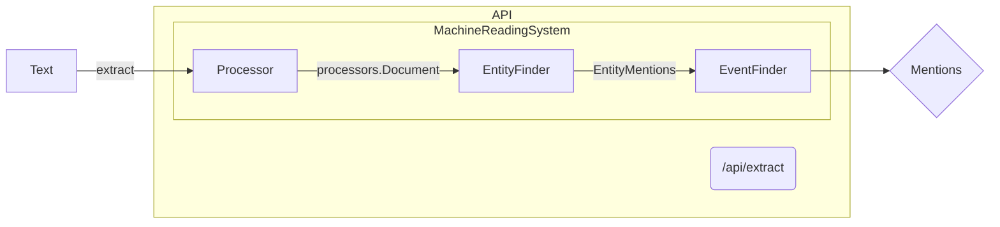

# How it Works

The ```/api/extract``` endpoint will be used as a running example of the cgiar reader workflow. The api endpoints are defined in ```rest.app.controllers.ApiController.scala```.

The following components of the cgiar reader can be developed following the [Odin manual](https://arxiv.org/pdf/1509.07513.pdf).

## Rules

Rules (and the taxonomy) are written in [YAML](https://yaml.org/). To develop, rules should be added to the entities and events grammars in ```reader.grammars.cgiar```, NOT ```reader.src.main.resources.ai.lum.reader.grammars.cgiar```. When the api is launched, the ```reader.grammars.cgiar``` directory is used to update the congruent directory in ```reader.src```, which is used in defining the ```MachineReadingSystem``` over which the api endpoints are run.

Rules should be developed in a test oriented manner. That is, tests should be written before the rules. Tests should capture what the expected output of the new rules should be, based on example inputs and the intended purpose.

The rules are split into separate `entities` and `events` grammars. This is due to the workflow of the `MachineReadingSystem` which makes entity mentions available to the `EventFinder` (which runs the events grammar over the entity mentions). Both the entities and events grammars include a `master.yml` and auxiliary grammars. These auxiliary grammars are imported into master, and thus only master is used in defining in the `EntityFinder` and `EventFinder`.

## Taxonomy

The taxonomy should be developed alongside the rules in the same manner. Always add to the taxonomy under ```reader.grammars.cgiar``` and NOT the corresponding directory under ```reader.src```.

The taxonomy represents the hiearchical structure of the entities and events being extracted. For example, if a rule produces the label ```Date```, the resultant mention in the json file will be displayed with the labels ```Constraint, TimeConstraint, TimeExpression, Date```, representing the hypernymic relationship of the rule's label.

## Actions

Actions dictate how text is annotated, how rules are applied to annotated text, and the final structure of the resultant mentions.

The `MachineReadingSystem` stipulates that the `EntityFinder` and `EventFinder` have three types of actions: actions, globalAction, and finalAction. The location of these actions is found in the config file used to initialize the MachineReadingSystem. For the running example this is ```reference.conf```, which sets the actions for both the Entity and Event Finder as ```CustomActions.scala```, which can be found under ```reader.src.main.resources.ai.lum.mr.cgiar.odin```. The global and final actions differ for the `EntityFinder` and `EventFinder`, as is expected given the flow of extraction. Global actions can be found in ```OdinActions.scala```, under ```reader.src.main.resources.scala.ai.lum.mr.actions```. Under the running config, the EntityFinder's globalAction is ```identityAction``` and the EventFinder's globalAction is ```cleanupEvents```. The final actions are ```cleanupEntities``` and ```finalSweep```. These globalActions and finalActions are in line with the cgiar Reader workflow, in which the annotated text is first run through the EntityFinder and then the EventFinder, which is run over the "cleaned up" entity mentions, followed by a "clean up" of the event mentions and a "final sweep" of all resultant mentions.

## API Workflows

When the REST API is launced an instance of a `MachineReadingSystem` object is created with the values specified in the config.yml file. The `MachineReadingSystem` in turn creates an instance of a `Processor` object, a `EntityFinder` object, and a `EventFinder` object. The latter are instanced based on the currently defined entities and events grammars. Text which is run through the `/api/extract` endpoint is passed to the `MachineReadingSystem` via its `extract()` method. This method first runs the text through the `Processor` object creating `Annotated Text`, which is then passed to the `EntityFinder` which finds all entity mentions, runs global actions, then runs the final action (in this case a "clean up" action). The entity mentions are then passed to the `EventFinder` which finds all event mentions and performs final "clean up" actions. Thus, a final JSON of all mentions is created for the input text.

